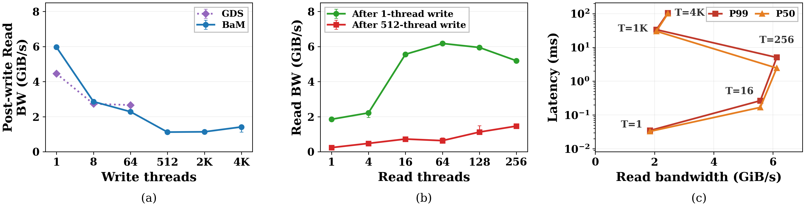
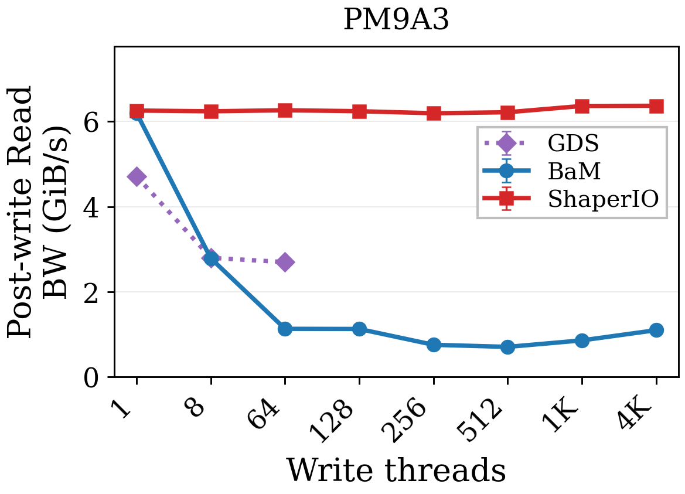

# ShaperIO

Artifact for **The GPU Changes Everything: Rethinking GPU I/O Stack at Massive Scale**, USENIX ATC 2026.

## Hardware and Software

- NVIDIA A100-SXM4-40GB, with PCIe peer-to-peer access to the SSD.
- Samsung PM9A3 7.68 TB, firmware GDC5602Q, namespace 1, 512-byte LBA format.
- Intel Xeon Gold 6530 CPU.
- Linux 6.8, CUDA 12.4, NVIDIA open kernel driver 550.54.14, and NVIDIA GDS/cuFile.
- CMake 3.18+, GCC with C++11, Python 3.10+, and Matplotlib 3.5+.
- Linux kernel headers and the matching NVIDIA driver sources and `Module.symvers`.

Use an account with sudo access. The experiment commands format the SSD selected in `configs/device.json` and erase its contents. Use a dedicated experiment SSD.

## Setup

Install Git, GCC/G++, CMake, kernel headers, NVMe utilities, and the Python 3, Matplotlib, and NumPy runtime and plotting dependencies. GCC 12 is needed to build the module for the provided Linux 6.8 kernel:

```bash
sudo apt update
sudo apt install -y git build-essential gcc-12 cmake linux-headers-$(uname -r) nvme-cli \
  e2fsprogs util-linux python3 python3-matplotlib python3-numpy
export PATH=/usr/local/cuda/bin:$PATH
export CUDA_MODULE_LOADING=EAGER
```

Clone the repository and enter it. Run all remaining commands from this directory:

```bash
git clone https://github.com/ScaleXLab/ATC26-ShaperIO.git
cd ATC26-ShaperIO
```

The provided review host already has CUDA, the NVIDIA open driver, GDS, matching driver sources, and the BIOS/PCIe configuration installed. On another host, enable Above 4G Decoding in the BIOS, disable IOMMU, configure the PCIe path for peer-to-peer access, and install these components. Check that NVMe and the GPU are supported and that platform verification succeeds:

```bash
sudo modprobe nvidia-fs
sudo /usr/local/cuda/gds/tools/gdscheck -p
```

Build the benchmarks and the libnvm module:

```bash
cmake -S . -B build \
  -DCMAKE_CUDA_COMPILER=/usr/local/cuda/bin/nvcc \
  -DAE_BUILD_KERNEL_MODULE=ON \
  -DNVIDIA=/usr/src/nvidia-550.54.14/nvidia \
  -DNVIDIA_SYMVERS=/usr/src/nvidia-550.54.14/Module.symvers
cmake --build build -j 8
cmake --build build --target kernel_module
```

Return the experiment SSD to the kernel driver, load the newly built libnvm module, and allocate hugepages for the NVMe queues:

```bash
sudo python3 tools/prepare_pm9a3.py kernel
if [ -d /sys/module/libnvm ]; then
  sudo rmmod libnvm
fi
sudo insmod build/module/libnvm.ko max_num_ctrls=64
sudo sysctl -w vm.nr_hugepages=512
```

Run the following experiments one at a time. Each command handles device identity checks, formatting, driver binding, measurements, and plotting, and sets `CUDA_MODULE_LOADING=EAGER` for the benchmarks. Each point runs **once** by default; append `--repetitions 3` to measure each point three times. Each output directory must be new; move an earlier result directory before repeating its command.

## Write Concurrency and Read Bandwidth (Figure 1(a))

Write data using BaM and GDS, then measure read bandwidth as write concurrency increases:

```bash
sudo python3 tools/run_figures.py fig1a --output results/fig1a --allow-write
```

The script formats the SSD before each write condition. Logs and CSV files are saved under `results/fig1a/`; plots are saved as `results/fig1a/figures/fig1a.png` and `fig1a.pdf`.

## Post-Write Read Scaling (Figure 1(b))

Measure how increasing BaM read concurrency affects bandwidth after low- and high-concurrency writes:

```bash
sudo python3 tools/run_figures.py fig1b --output results/fig1b --allow-write
```

The script formats the SSD before each writer/reader condition. Logs and CSV files are saved under `results/fig1b/`; plots are saved as `results/fig1b/figures/fig1b.png` and `fig1b.pdf`.

## Read Bandwidth and I/O Latency (Figure 1(c))

Sweep BaM read concurrency and measure bandwidth and P50/P99 I/O latency:

```bash
sudo python3 tools/run_figures.py fig1c --output results/fig1c --allow-write
```

The script formats the SSD and sequentially writes the data once per repetition. All read conditions in that repetition share the prepared data. Logs and CSV files are saved under `results/fig1c/`; plots are saved as `results/fig1c/figures/fig1c.png` and `fig1c.pdf`.

## Write Scheduling and Post-Write Read Bandwidth (Figure 3)

Compare post-write read bandwidth for BaM, GDS, and ShaperIO across write concurrency levels:

```bash
sudo python3 tools/run_figures.py fig3 --output results/fig3 --allow-write
```

The script formats the SSD before each write condition for each system. Logs and CSV files are saved under `results/fig3/`; plots are saved as `results/fig3/figures/fig3.png` and `fig3.pdf`.

## After the Experiments

Return the SSD to the kernel driver after completing the experiments:

```bash
sudo python3 tools/prepare_pm9a3.py kernel
sudo chown -R "$(id -u):$(id -g)" results
```

## Plot the Included Results

Plotting and data verification run without GPU or SSD access:

```bash
python3 tools/verify_artifact.py
python3 tools/plot_figures.py
```

The figures are written to [`figures/`](figures/), together with `measurements.csv`. The experiment commands above automatically plot newly collected measurements.





The included Figure 1(a), Figure 1(b), and Figure 3 GDS series report medians of three measurements, with minimum/maximum error bars. Figure 1(c) and Figure 3 BaM/ShaperIO contain one measurement per point. [Experiment details](docs/experiments.md) lists the parameters and measurement protocol; [results](docs/results.md) gives the numeric tables.

## Repository Layout

```text
benchmarks/io/            GPU and cuFile benchmark drivers
benchmarks/io_scheduler/  ShaperIO scheduler implementation
include/ src/ module/     BaM/libnvm headers, library, and kernel module
configs/                 Device identity and three experiment profiles
tools/                   Run, aggregate, plot, and verify commands
tests/                   Workload and experiment-pipeline checks
data/reference/          Original logs, run metadata, and summary CSV files
figures/                 Generated PNG/PDF figures and combined CSV
provenance/              Source and measurement SHA256 manifests
docs/                    Experiment parameters and measured results
```

The main source files and entry points are:

| File | Responsibility |
|---|---|
| `benchmarks/io/gpu_io_benchmark.cu` | BaM and ShaperIO GPU I/O benchmark; builds `gpu-io-benchmark` |
| `benchmarks/io/gds_io_benchmark.cu` | GDS/cuFile I/O benchmark; builds `gds-io-benchmark` |
| `benchmarks/io/io_workload.h` | Shared address generation, workload validation, and command-line options |
| `tools/run_figures.py` | Run selected figures and generate their plots |
| `tools/experiment_runner.py` | Plan and execute benchmark commands; aggregate measurements |
| `tools/prepare_pm9a3.py` | Identify, format, and bind the experiment SSD |
| `tools/measurement_records.py` | Load run records and check summaries against raw logs |
| `tools/plot_figures.py` | Export figure PNG/PDF files and the combined CSV |
| `tools/verify_artifact.py` | Check source hashes, measurement hashes, and figure coverage |

## Validation

```bash
ctest --test-dir build --output-on-failure
python3 -m unittest discover -s tests -v
python3 tools/verify_artifact.py
```

## License

See [LICENSE](LICENSE). Bundled dependencies retain their license notices.
