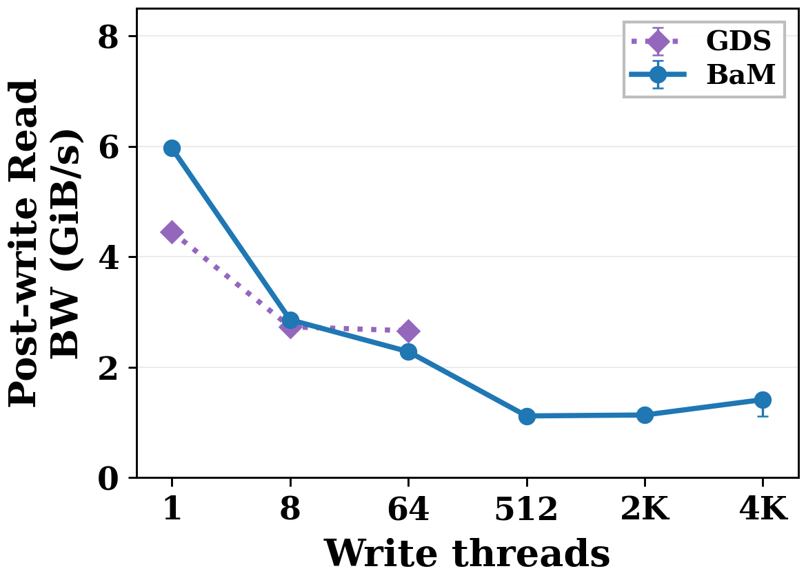
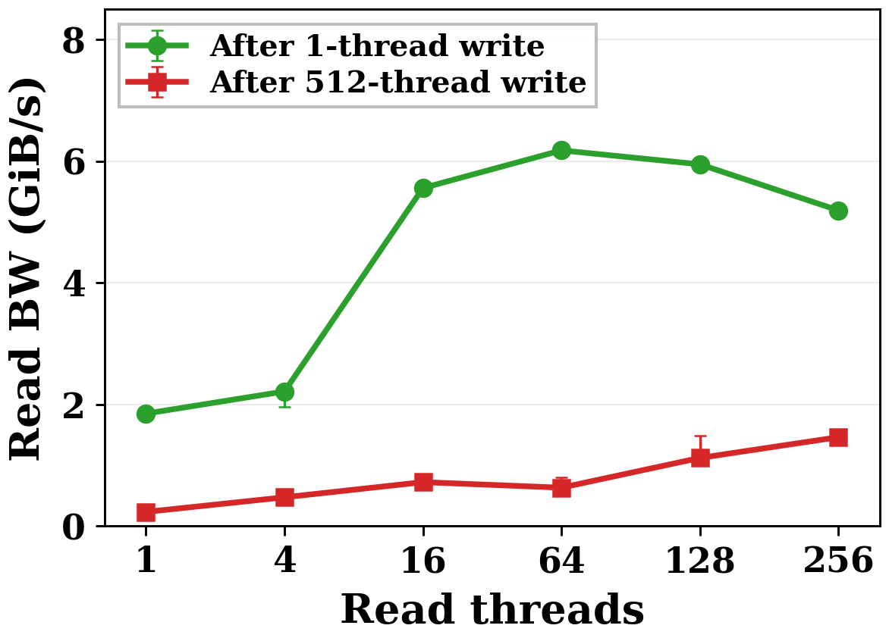
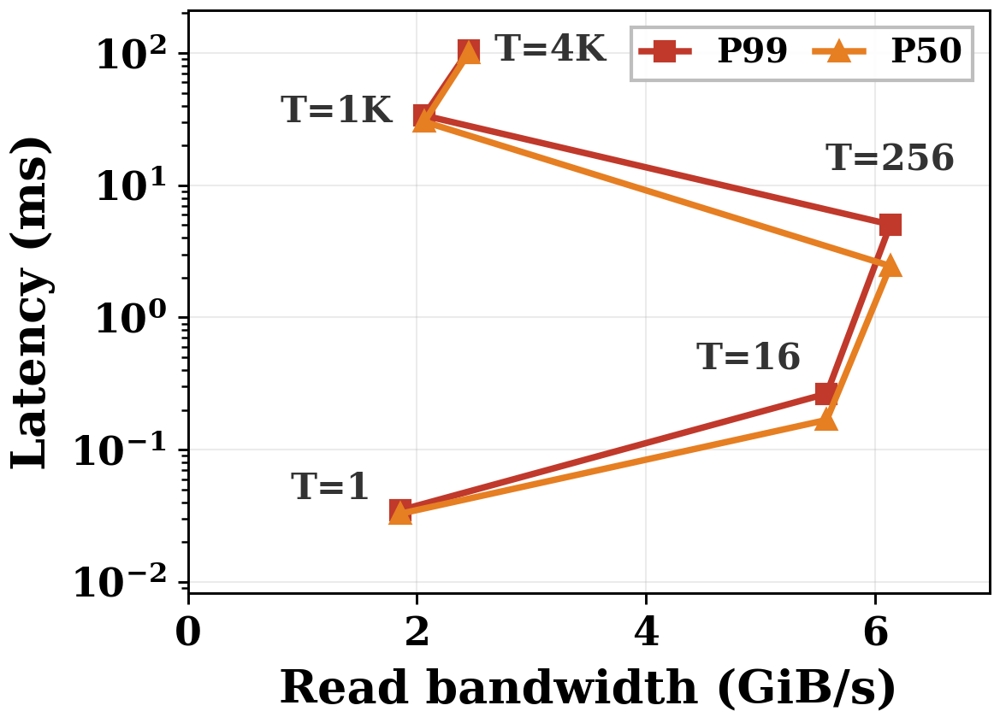

# PM9A3 Results

All bandwidth values are GiB/s. Figure 1(a), Figure 1(b), and Figure 3 GDS values are medians of three measurements. Figure 1(c) and Figure 3 BaM/ShaperIO values are single measurements.

## Figure 1(a)

| Writers | BaM | GDS |
|---:|---:|---:|
| 1 | 5.9658 | 4.4535 |
| 8 | 2.8589 | 2.7315 |
| 64 | 2.2826 | 2.6620 |
| 512 | 1.1181 | |
| 2048 | 1.1350 | |
| 4096 | 1.4133 | |

BaM read bandwidth decreases by 81.3% between 1 and 512 preceding writers.

## Figure 1(b)

| Readers | After 1 writer | After 512 writers |
|---:|---:|---:|
| 1 | 1.8495 | 0.2334 |
| 4 | 2.2139 | 0.4734 |
| 16 | 5.5583 | 0.7226 |
| 64 | 6.1772 | 0.6314 |
| 128 | 5.9478 | 1.1209 |
| 256 | 5.1905 | 1.4618 |

Increasing reader concurrency after 512 writers does not recover the peak bandwidth reached after one writer.

## Figure 1(c)

| Readers | Bandwidth | P50 (ms) | P99 (ms) |
|---:|---:|---:|---:|
| 1 | 1.8522 | 0.032768 | 0.034816 |
| 16 | 5.5756 | 0.167936 | 0.265216 |
| 256 | 6.1313 | 2.450432 | 5.051392 |
| 1024 | 2.0635 | 30.223360 | 33.685504 |
| 4096 | 2.4529 | 100.691968 | 105.296896 |

Bandwidth peaks at 256 readers in this sweep. Higher concurrency increases latency and reduces throughput.

## Figure 3

| Writers | BaM | GDS | ShaperIO |
|---:|---:|---:|---:|
| 1 | 6.1967 | 4.7145 | 6.2562 |
| 8 | 2.7857 | 2.7982 | 6.2383 |
| 64 | 1.1311 | 2.6982 | 6.2631 |
| 128 | 1.1275 | | 6.2409 |
| 256 | 0.7563 | | 6.1925 |
| 512 | 0.7075 | | 6.2163 |
| 1024 | 0.8602 | | 6.3635 |
| 4096 | 1.1000 | | 6.3680 |

At 512 writers, BaM drops 88.58% relative to its one-writer result. ShaperIO reaches 6.2163 GiB/s, 8.79 times BaM at that point. Across the sweep, ShaperIO read bandwidth ranges from 6.1925 to 6.3680 GiB/s.

The complete values, sample counts, and minimum/maximum measurements are in [`figures/measurements.csv`](../figures/measurements.csv). Original measurements are in [`data/reference/`](../data/reference/).
